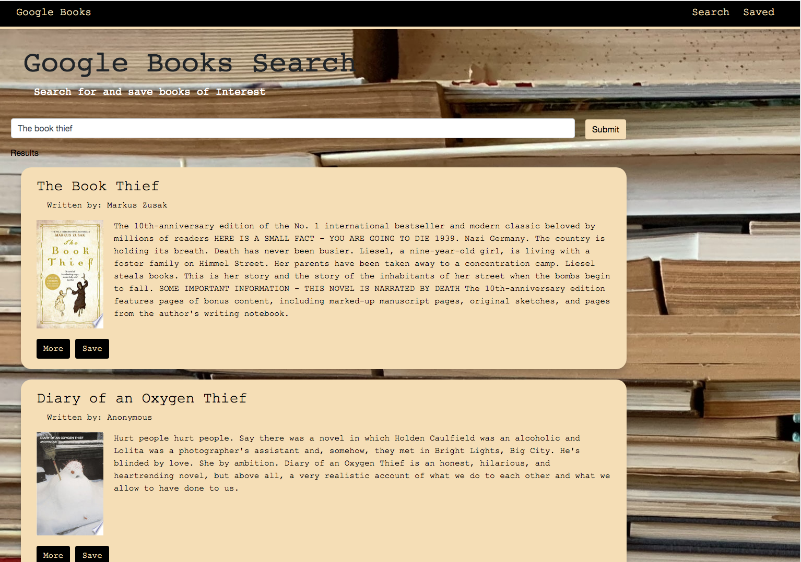

# Google Books Search (React)

---
| Table of Contents |
|---|
| [Description](#Description) |
| [Technologies Utilised](#TechnologiesUtilised) |
| [Functionality](#Functionality) |
| [Links](#Links) |
| [Installation](#Installation) |
| [License](#License) |
| [Contributing](#Contributing) |
| [Questions](#Questions) |
---

## Description 
A MERN stack application that allows users to search for books through Google Books API. Users have the option to "view" a book which leads them to the book on Google Books, or "save" a book where book details are stored to the Mongo database.

## Technologies Utilised
React, MongoDB, Express, Bootstrap

## Functionality 
* Model View Controller Design Pattern.
* User data is saved into the database and updated with mongoose.
* CRUD best practices followed.
* SPA with HTML elements generated with React components
* Deployed to Heroku using JAWSDB 

## Links

Deployed link <a href="https://safe-depths-43279.herokuapp.com/">here</a>

The application should look similar to this: 

## Installation 
Clone the package and run 'npm i' in your terminal to install all the dependencies. Then run 'npm start' to run the application in development mode. 

## License 

## Contributing
To contribute please refer to https://github.com/microsoft/vscode/wiki/How-to-Contribute

## Questions
Please direct questions to the following email: karrynsaw@gmail.com

Github: https://github.com/KarrynS